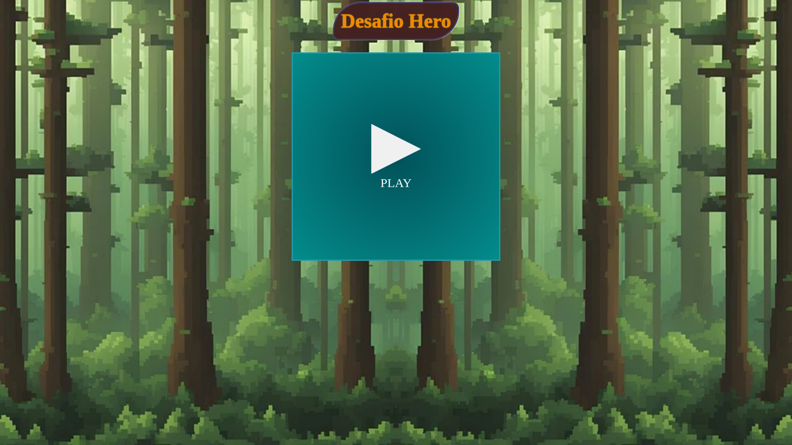
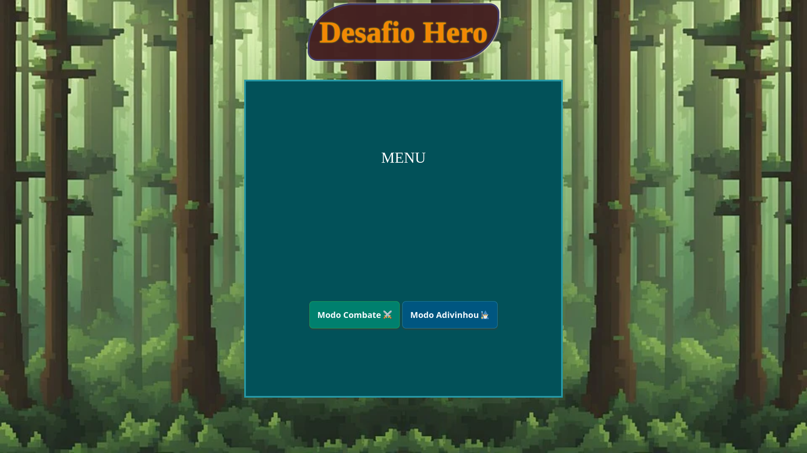
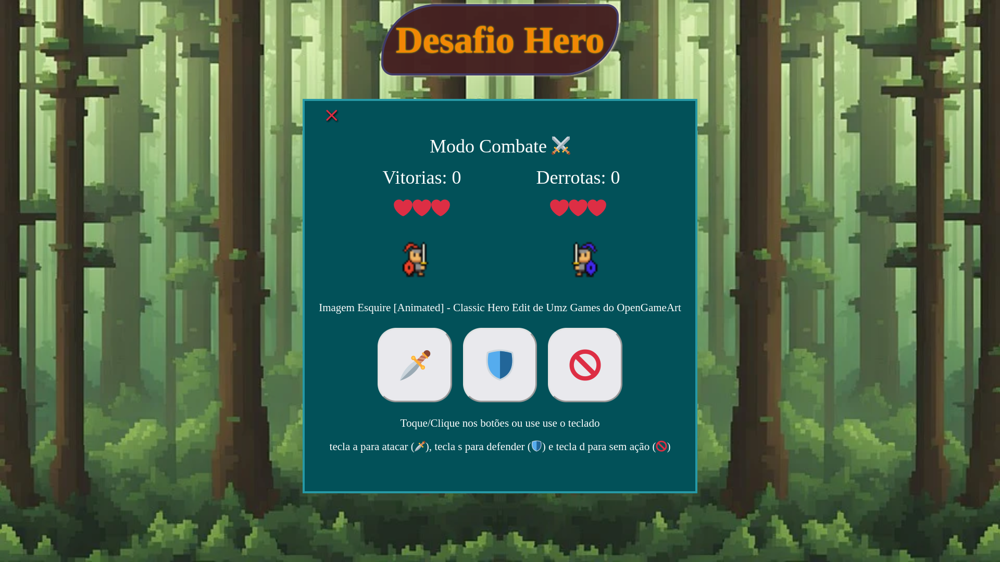
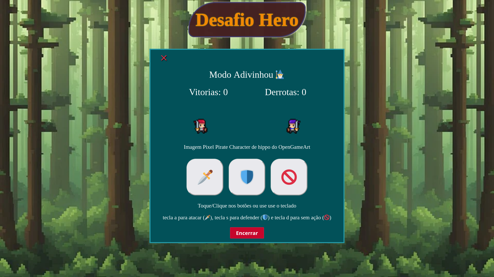

# Desafio Hero Santander 🦸🔥
Projeto do Bootcamp Godot Santander

## DESAFIO DIO - Calculadora de Partidas Rankeadas 📜


```
Entendendo o Desafio

Instruções para entrega
 # 2️⃣ Calculadora de partidas Rankeadas

**O Que deve ser utilizado**

- Variáveis
- Operadores
- Laços de repetição
- Estruturas de decisões
- Funções

## Objetivo:

Crie uma função que recebe como parâmetro a quantidade de vitórias e derrotas de um jogador,
depois disso retorne o resultado para uma variável, o saldo de Rankeadas deve ser feito através do calculo (vitórias - derrotas)

Se vitórias for menor do que 10 = Ferro
Se vitórias for entre 11 e 20 = Bronze
Se vitórias for entre 21 e 50 = Prata
Se vitórias for entre 51 e 80 = Ouro
Se vitórias for entre 81 e 90 = Diamante
Se vitórias for entre 91 e 100 = Lendário
Se vitórias for maior ou igual a 101 = Imortal

## Saída

Ao final deve se exibir uma mensagem:
"O Herói tem de saldo de **{saldoVitorias}** está no nível de **{nivel}**"

```


## Demonstração 🎮

[Acesse e conheça](https://1001utilidades.online/bootcampgodotsantander/calculadoraderanking)


## Screenshots 📸










## Tecnologias utilizadas 🪄

1. 

3. 

4. 

## Exemplo de Código 📄
[Esse simples código](src/public/codigo-simples.txt) já completaria o desafio, mas é meio sem graça. Quis colocar um pouco de pimenta 🌶️, afinal o curso é sobre jogos.

### Considerações 📑
	Gostei muito de fazer esse desafio, foi muito legal criar dois modos de jogos, mas confessou que o modo adivinhou é muito mais divertido, pois é bem mais difícil. Não consegui chegar em um ponto de equilíbrio em nenhum dos modos. O Modo Combate acabou se tornando muito fácil, é basicamente atacar (não é como pedra, papel, tesoura (jokenpô) da ideia original), o que pode perder a graça, e no outro modo você tem que ser realmente um adivinhou é muito difícil, do jeito que tá é quase impossível ser imortal. Essas são minhas considerações como jogadora, mas como programadora não vou mexer no código, por enquanto tá OK. Fiquem à vontade para mexer no meu código, tentei deixar o mais simples possível.
